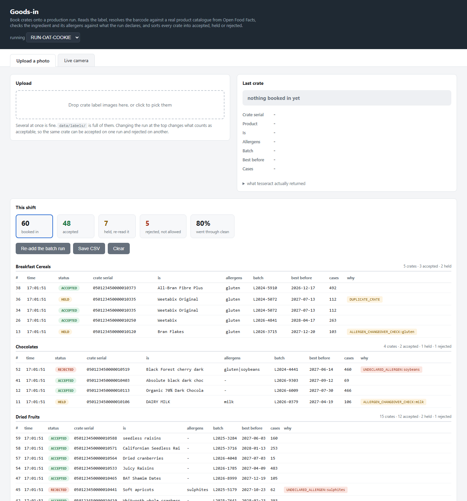
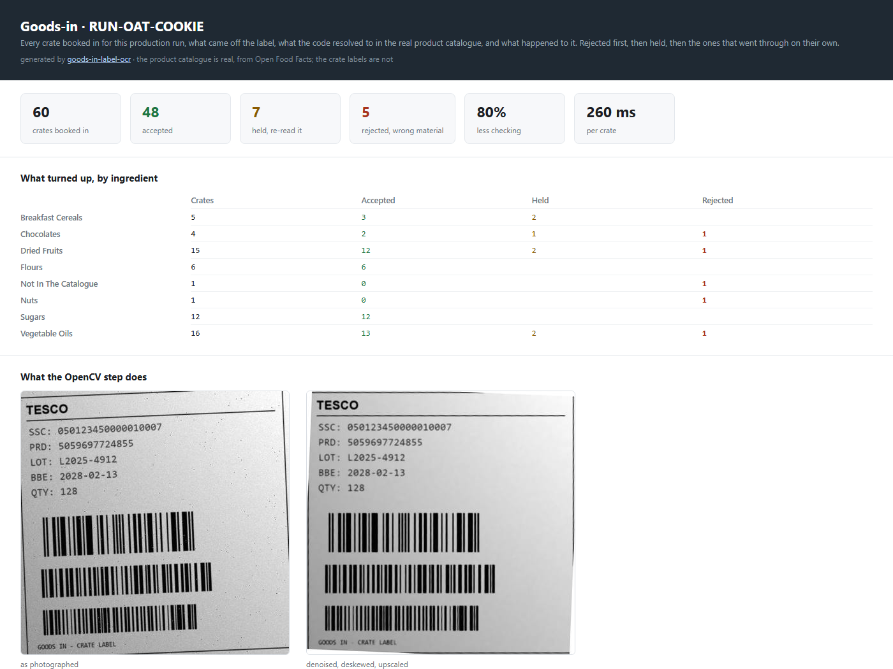
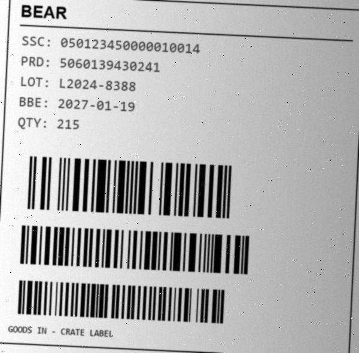
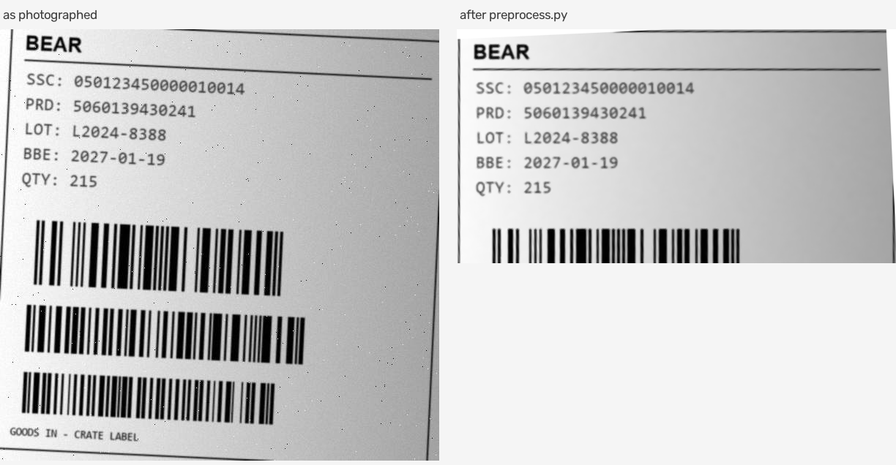

# Goods-in label verification

Reads the label on an incoming crate of ingredients, resolves the barcode against a real product
catalogue, checks what is inside against what the production run is allowed to contain, and holds
or rejects anything that should not go to the line.

The product catalogue is real. 407 products pulled from
[Open Food Facts](https://world.openfoodfacts.org) — real EAN-13 barcodes, real brands, real pack
sizes and, the part that actually matters, **real allergen data**.



Python, OpenCV, Tesseract, pyzbar, Flask. 36 tests.

| | |
|---|---|
| character accuracy off the OCR | **95.5%** |
| with the OpenCV step turned off | 31.0% |
| after the barcode and catalogue repairs | **99.6%** |
| 60 crates | 48 accepted, 7 held, 5 rejected |
| manual checking | **down 80.0%** |
| 10 crates, start to finish | 2.59 s |

```
python fetch_products.py                 # real catalogue, run once
python make_labels.py --n 60 --seed 7    # crates to read
python app.py                            # then http://localhost:5000
```

**[walkthrough.ipynb](walkthrough.ipynb) is the place to start if you just want to see how it
works.** It goes through the whole thing with the pictures and the numbers inline, including the
bits that went wrong, and it is already run so you do not have to run anything to read it.

**Without installing anything:**

- [the batch report](https://gunaprakshkethineni.github.io/goods-in-label-ocr/) — all 60 crates,
  what was read off each one and why the five were refused. A static page, nothing to run.
- **Code → Codespaces → Create codespace** on this repo builds a container with Tesseract and
  zbar already in it, generates the labels and reads them. Then `python app.py` and Codespaces
  forwards port 5000, so the desk opens in your browser. Tesseract and zbar are system packages
  that pip cannot install, which is the whole reason `.devcontainer/` exists.

## The problem it solves

When a delivery arrives, somebody has to get what is printed on every crate into the system.
Normally that means reading each label and typing four fields. It is slow, and a typo in a batch
code is invisible until there is a recall and you cannot say which pallets are affected.

But the expensive mistakes are not typos at all. A production run makes a product whose pack
carries a **declared allergen list**. If an ingredient turns up carrying an allergen that is not
on that list, the finished product is mislabelled — and undeclared allergens are the single
largest cause of food recalls. The crate looks completely normal. The ingredient is perfectly
good. It is just not allowed in *this* product.

So the job is not "read text from a picture". Any OCR library does that in one line. The job is
deciding **which readings you can trust, and whether this crate belongs on this run** — because a
reader that is right 98% of the time is no use if a person still has to check all 60 rows to find
the wrong ones.

## Three outcomes, not two

A crate comes out as **accepted**, **held** or **rejected**, and they go to different people.

**Accepted** books itself in and nobody looks at it. **Held** means the reader was not sure what
it was looking at, so somebody walks over and reads the crate with their own eyes; it is probably
fine. **Rejected** means the reading was solid and the ingredient genuinely is not allowed on
this run, so it does not go to the line.

Which one you get is not just severity. **You cannot reject a crate on a reading you do not
trust.** If the barcode will not scan and the code then looks unknown, the honest answer is not
"rejected, unknown product", it is "I could not read this, someone come and look" — because the
unknown code might just be the misreading talking. So anything uncertain is held even when it
also looks non-conforming.

| Check | What it catches | Outcome |
|---|---|---|
| `UNDECLARED_ALLERGEN` | ingredient brings an allergen the finished pack does not declare | rejected |
| `NOT_ON_RUN_SPEC` | an ingredient this run does not use at all | rejected |
| `EXPIRED` | past its best before | rejected |
| `CODE_NOT_IN_CATALOGUE` | a product nobody has booked in | rejected |
| `DUPLICATE_CRATE` | this exact crate has been booked in already | held |
| `BARCODE_UNREADABLE` / `BATCH_` / `SERIAL_` | zbar got nothing off one of the three codes | held |
| `CODE_MISMATCH_ON_LABEL` etc. | printed text and barcode are genuinely different numbers | held |
| `ALLERGEN_CHANGEOVER_CHECK` | first ingredient of that allergen onto this line | held |
| `LOT_FORMAT_BAD`, `FIELD_MISSING`, `QTY_*` | the reader was not confident | held |

## Results

60 crates for `RUN-OAT-COOKIE`, Python 3.12, Tesseract 5.4.0, i5 laptop, `--seed 7`.

| | |
|---|---|
| character accuracy, straight off the OCR | **95.5%** |
| same thing with the OpenCV step turned off | 31.0% |
| after the barcode and catalogue repairs | **99.6%** |
| 10 crates, start to finish | **2.59 s** (259 ms each) |
| accepted, booked straight in | **48 of 60** |
| held, a person has to deal with it | 7 |
| rejected, not allowed on this run | 5 |
| so manual checking down | **80.0%** |

The OpenCV preprocessing is worth **64.6 percentage points** on its own. That is the number I
care about most, because it is the difference between the tool being useful and being noise.

Per field, before and after the repairs:

| | off the OCR | after repairs |
|---|---|---|
| crate serial (18 digits) | 44/60 | **59/60** |
| product code (13 digits) | 57/60 | **60/60** |
| batch | 53/60 | **60/60** |
| best before | 53/60 | **60/60** |
| case count | 54/60 | 54/60 |

These move by a few tenths between runs even on the same seed, because the best before dates are
generated relative to today, so the labels are not byte for byte identical from one day to the
next. The shape of the table is what matters, not the last digit.

Two things fall out of that table. The crate serial is the worst field off the OCR, at 42 of 60,
because it is eighteen digits and every extra digit is another chance to misread one. And the
case count is the only field that does not improve, because it is the only field with no barcode
behind it.

That is the whole architecture in one table. Where a checksum-backed code exists the reading
becomes reliable no matter how bad the print is; where it does not, OCR is on its own and you can
measure exactly what that costs you.

## The thing worth demoing

Run the same 60 crates against a different production run:

```
python validate.py RUN-OAT-COOKIE    ->  47 accepted,  8 held,   5 rejected
python validate.py RUN-FREE-FROM     ->  32 accepted,  7 held,  21 rejected
```

Same crates, same labels, same reader. The free-from run declares no allergens at all, so every
gluten or milk ingredient that was perfectly acceptable a moment ago becomes an undeclared
allergen. Nothing about the crate changed; what changed is what it is going into.

Real examples it rejected, with real products and real allergen data:

```
3179142054633  Amandes en poudre   nuts                         UNDECLARED_ALLERGEN:nuts
3270720090057  Formule Zen         gluten|nuts|sesame|sulphites UNDECLARED_ALLERGEN:nuts,sesame-seeds,sulphites
8901220905712  Baidyanath Karela   -                            NOT_ON_RUN_SPEC:juices
8008698004852  MIX C PATISSERIE    -                            EXPIRED
```

## Setup

Tesseract is a separate program, pip does not install it:

```
winget install UB-Mannheim.TesseractOCR
```

Then:

```
pip install -r requirements.txt
python fetch_products.py
```

`fetch_products.py` pulls the real catalogue and caches it to `data/product_master.csv`. Run it
once; everything after that works offline. Open Food Facts is a free service run by a non-profit,
so it rate limits and the script backs off and retries. If a category still fails, run it again
and it tops up what it already has.

## Booking crates in

```
python app.py
```

Then http://localhost:5000. Pick the run at the top, then drop crate photos in or turn the camera
on and hold labels up to it. You get the code, what it resolved to in the real catalogue, its
real allergens, the batch, the best before, and whether it was accepted, held or rejected.

Underneath is the running log, which starts with the last batch run already loaded. It is grouped
by ingredient rather than shown as one long list in the order things happened, because a delivery
arrives as so many pallets of flour and so many of oil and that is how the person booking it in
thinks about it. Each heading carries its own count, so you can see at a glance that every crate
of sugar went through and the one crate of nuts did not.

The four counters double as filters, so clicking **rejected** shows just those crates and why.
Save CSV writes the shift to `output/session_scans.csv`.

## Nobody pressing anything

```
python watch.py             # a simulated belt, runs off the labels in data/labels
python watch.py --camera     # a real camera, hold crates up to it
```

The desk in `app.py` still needs a person to present each crate. This does not. A camera looks at
the conveyor and crates get booked in as they pass.

Two things make that work, and neither of them is the OCR.

**The trigger.** Most frames off a conveyor are empty belt, and running Tesseract on all of them
would cost 250ms a frame for nothing. Trying to decode a barcode costs about 36ms, so that is the
gate: no barcode means no crate, skip the frame. On a 60 crate run it skipped 373 of 430 frames.

**Knowing when a crate is a new crate.** One crate crosses the camera over several frames and has
to be booked once. The crate serial is what makes that possible, but you cannot key on it alone,
because a different barcode drops out on each frame — the serial reads on one, only the batch code
on the next, the key changes and the crate gets booked twice. Keeping the whole set of codes seen
and calling it the same crate if anything overlaps fixed that.

It also waits for the crate's best frame rather than reading the first one it sees. The belt is
moving, so the first frame is usually the one smeared by motion. How many of the three barcodes
decoded is a free measure of how good the look was.

```
430 frames off the camera, 372 were empty belt or the same crate again
58 crates booked in, nobody pressed anything
  ACCEPTED  28
  HELD      28
  REJECTED   2
```

### And where it falls short, which is the interesting part

Those numbers are much worse than the batch tool's 48 / 7 / 5 on the same sixty labels, and two
things are wrong that are worth stating plainly rather than tuning away.

**Two crates never got booked at all.** They are the ones whose barcodes are scuffed past
reading, and the barcode is the trigger, so the camera never noticed them. A crate that cannot be
read silently passing the station is worse than one that gets held. A real line does not rely on
the barcode for presence, it has a photo-eye that says something is there and lets the vision
system report that it could not read it.

**Reading a label found in a scene is harder than reading a label handed to you.** Measured on the
same twenty labels, 91 fields out of 100 read correctly straight off the file, and 52 through the
belt. Every field of that gap is in the localisation, not the OCR. Finding the label turned out to
be a bigger problem than reading it, which I did not expect at all.

## Photographed at an angle

```
python angle_test.py
```

A camera over a conveyor is never perfectly square to the crate, so the label arrives as a
trapezoid. Deskew cannot fix that, because the label is not rotated, it is tilted away: the far
edge is genuinely shorter than the near one and turning the picture will not lengthen it.

`deperspective()` finds the four corners of the label and warps them back to a rectangle, which is
what a document scanner app does to a photo of a page. Then the label gets resized back to the
size a label is supposed to be, so the text crop lands in the same place on every crate.

| | character accuracy | fields exactly right |
|---|---|---|
| square on | 99.0% | 115 of 125 |
| tilted | 86.3% | 76 of 125 |
| tilted, then flattened | **95.2%** | **100 of 125** |

Tilting costs about 13 points and flattening gets 9 of them back. It only finds the corners on 16
labels of 25, so the remaining gap is detection rate rather than the warp itself.

## On real photographs

```
python real_photo_test.py --n 24
```

Everything above is measured on labels I generated. This runs the same reader over photographs
other people took of real products, pulled from Open Food Facts: bad light, glare off plastic,
packaging bent round a jar, half the shot in shadow.

It cannot test the crate label parser, because a jar of nutella does not have `SSC` and `BBE`
printed on it in a fixed layout. It tests the two things underneath.

```
photos looked at:         70
barcode decoded in:        9
  and it was correct:      9
  and it was wrong:        0
brand name read off the photo: 11 of 67
```

**The barcode number that matters is the zero.** Nine decodes, nine correct, nothing invented. The
low rate is because most of these are front-of-pack shots with no barcode in frame at all, not
because the decoder struggled.

**The OCR number is the honest one.** Eleven brand names out of sixty seven. This pipeline is built
for flat printed labels in a known layout and it is not much good at reading a curved jar in a
kitchen. That is worth knowing and worth saying, rather than only ever testing on pictures I drew
myself.

## Seeing the whole batch

```
python make_labels.py --n 60 --seed 7
python demo.py
```

Builds `output/report.html` and opens it: every crate as a picture next to what was read, what it
resolved to, and what happened to it. Rejected first. The images are baked in so you can send the
file to somebody.



## Running the pieces

```
python fetch_products.py                 # real catalogue -> data/product_master.csv
python make_labels.py --n 60 --seed 7    # crates to read
python ocr_reader.py                     # read them -> output/inventory.csv
python validate.py                       # check them -> inventory_final.csv + flagged.csv
python check_accuracy.py                 # score it against the ground truth
```

`python batch_test.py` does the timing run, `python -m pytest` runs the tests (31 of them), and
`python preprocess.py data/labels/crate_003.png` dumps each stage of the cleanup to
`output/debug/`.

## What is real and what is not

Worth being precise about, because it is the first thing anyone should ask.

**Real:** the product catalogue, the EAN-13 barcodes, the brands, the pack sizes, the categories
and the allergens. All of it from Open Food Facts, which is open data under the ODbL.

**Generated:** the label images, the batch numbers and the best before dates. Those are
per-delivery things printed on the crate as it is packed. They are not in any public database,
and without ground truth there is no way to measure reading accuracy at all. So the *reading* is
tested against labels I generate, and the *checking* is done against a real catalogue.



That is one of them. The brand, the product code and the EAN-13 barcode are a real product;
the serial, batch and best before are not, and neither is the picture.

`make_labels.py` draws a crate label from a real product record, then attacks it: rotates it a
few degrees, lays a shadow across it, blurs it, adds sensor noise and speckle, and saves it as a
low quality JPEG. The field text prints in grey rather than black because thermal label printers
fade, and that one setting is what makes the reader work for its money.

About one crate in eight has something genuinely wrong with it, and the generator records what,
so afterwards a real catch can be told from a false alarm. The defect plan rounds every rate up
to at least one, so every rule gets exercised on every run.

## Three barcodes, which is what real crates carry

| barcode | carries | GS1 identifier |
|---|---|---|
| EAN-13 | the product | — |
| Code128 | best before, then batch | `(17)` then `(10)` |
| Code128 | the crate serial | `(00)` |

The batch one puts `17` first because it is fixed length and `10` last because it is variable, and
then no separator is needed between them. Keeping the payload all digits matters too: Code128
packs digit pairs into one symbol, so 18 digits comes out about the same width as 9 letters.

**The crate serial is the interesting one.** It is an SSCC, eighteen digits with a GS1 mod-10
check digit, and it is the only thing on the label that identifies *this crate* rather than what
is inside it. The product code, batch and date are all identical across every crate of the same
delivery. So without a serial there is no way to tell the second drum of a split delivery from
the same drum being scanned twice — which is exactly the limitation this project had before, and
`DUPLICATE_CRATE` is a real check now rather than a guess.

This is also why the batch and date end up reliable and the case count does not. A batch code has
no master to check against — it is unique to that delivery — so without a barcode carrying it, a
misread digit is simply undetectable.

## The OpenCV part



`preprocess.py`, in order: grayscale, median blur for the speckle, `fastNlMeansDenoising` for the
sensor grain, deskew using `minAreaRect` on the text pixels, then a 2x upscale with cubic
interpolation. Then Tesseract with `--psm 6` and a character whitelist.

`searchWindowSize` on the denoiser defaults to 21 and costs about a second per ten crates on its
own. Dropping it to 9 made the whole thing a third faster and scored slightly better, because a
big search window averages over half the label and starts softening the digits.

## Things that did not work

**Thresholding it myself.** I had an adaptive threshold and a morphology open in the pipeline and
both made it worse, about 8 points worse. Tesseract binarises internally and is better at it than
my fixed block size was.

**`BORDER_REPLICATE` on the deskew.** Rotating with replicated borders smears the black frame line
of the label into big black wedges in the corners. The picture still looks perfectly readable to a
human and Tesseract returns `F M110` for the whole label. Eight of sixty came back empty.

**`minAreaRect` angles.** My OpenCV hands back angles in (-90, 0], so a label tilted 1.3 degrees
arrives as -88.7. I was checking `abs(angle) > 10` and bailing out, which quietly turned the
deskew off on nearly every label. Folding the angle into -45..45 first took accuracy from 84.8%
to 96.9% in one go.

**Reading the product code as the case count.** The quantity is the only field with no barcode
behind it, so it has a fallback: if the tag is missing, take a line that is just digits. Then I
added a thirteen digit product code with a colon in front of it, and a crate of 85 boxes got
booked in as 3165433724019. The fallback now refuses any line whose tag belongs to another field,
and caps the length.

**Flagging every disagreement between print and barcode.** One character out is the OCR having a
bad day on a faded label, and the barcode has already corrected it, so there is nothing for
anybody to do. Flagging those held four crates for no reason. It now only shouts when the two are
two or more edits apart, which means a genuinely different number rather than a misread one.

**Putting the case count too close to the barcode.** It sat about 17px above it and Tesseract kept
swallowing the whole line into the barcode block and returning nothing. Moving the barcode down
fixed four false alarms at a stroke.

**Rules that never fired.** The changeover check fired sixteen times instead of twice, because a
held crate never got added to the list of what was at the line, so every gluten crate after the
first one still looked like the first. A rule you have never watched fire is not a rule you have
tested.

**A fixed tolerance for print-versus-barcode disagreement.** Two characters out was a sensible
line for a ten character batch code. Then the eighteen digit serial arrived and it flagged eight
crates, because a longer number simply collects more misreads. The tolerance scales with the
length of the field now.

**Anchoring the crop on the barcodes.** They seemed like the perfect landmark for finding the
label on the belt: pure black on white, and pyzbar hands back where it found them. But pyzbar
reports where the *bars* are, and a barcode image is bars plus a quiet zone either side — 3mm of
it, 24px at 200dpi. So the crop started up to 23px inside the label and sliced the left edge off
every field tag. The reader was looking for lines starting `SSC` and `PRD` and finding neither.

**A light grey conveyor.** I drew the simulated belt mid grey without thinking about it, and it is
a far harder picture than any real line would produce. A light belt is close enough in tone to a
white label that nothing segments them apart cleanly, and Tesseract reads the tread lines as
characters and staples them onto the end of whatever field shares that row: the batch came back as
`L2024-0452YEV`, the case count as `78PN`. Real conveyors are dark rubber. A white label on a black
belt is one threshold away from being found, and it is also what the real thing looks like.

**Framing the camera on the whole line.** Same mistake from the other direction: a 600px label in a
760px scene. A fixed installation aims the camera at where the label passes, so the label nearly
fills the frame, and most of the localisation problem simply is not there.

**Resizing the label whether or not the flattening worked.** The corner finder does not always
find four corners, and when it gives up it hands the picture back untouched. I resized to the
canonical label size regardless, so on every label it could not flatten I squashed the whole
padded frame into a label shaped box and made it worse than leaving it tilted. Flattening scored
below doing nothing until I checked whether it had actually happened.

**One fixed tolerance for the corner finder.** `approxPolyDP` with a single epsilon found four
corners on 13 labels out of 25. Taking the convex hull first, so a nick in the edge cannot add a
corner, and then trying a few tolerances until one returns exactly four, got it to 16.

**Letting Tesseract read the barcodes.** Adding the third barcode made the label 590px tall and
the batch went from 2.6 to 4.3 seconds, because Tesseract was chewing through 250px of bar
patterns looking for words. All the text is in the top third, so it gets cropped there before the
OCR. The crop has to happen after the deskew though, because the deskew needs the whole label
including the border to work the angle out.

**`dict(summary(), added=import_batch())`.** Reads fine, is wrong. Python evaluates the positional
argument before the keyword one, so the counts came back from before the import and the table
never moved.

## Limitations

The crates are synthetic, so 98.0% is 98.0% on my generator and not a promise about a photograph
of a real pallet in a real loading bay. Glare off shrink wrap, dust, perspective and creased
labels are all things I do not simulate.

The layout is fixed, one label format, and the field parser assumes it. Point it at a different
supplier's label and the barcodes will still decode but the printed fields will come back empty.
Supporting a new format means adding its layout; the checking and flagging logic is unchanged.

Open Food Facts is crowd sourced, so the catalogue has real-world mess in it. Allergen tags come
in more than one language (`avoine` and `oats`) and need normalising, some products have no
allergen data at all rather than none declared, and `0123456789012` is somebody's placeholder that
passes the EAN check digit perfectly well. The absence of an allergen tag is not proof there is no
allergen, which in a real plant would matter a great deal.

`ALLERGEN_CHANGEOVER_CHECK` and `DUPLICATE_CRATE` only know what has been booked in during this
session. A real one would ask the warehouse system what has already been received against that
delivery note.

## The same thing for a different industry

The reader and the rule engine do not care what is in the crate. They read a label, resolve a code
against a master, and apply rules about what is allowed where.

An earlier version of this repo pointed the identical pipeline at composite material intake for
wind turbine blade manufacturing, where the crates are epoxy resin, amine hardener, carbon fabric
and adhesive. The rules become QA release status, shelf life, and whether a hardener is compatible
with the resin already issued to that blade — system A resin cured with system B hardener makes a
blade that looks perfect on the floor and cracks under storm loading years later, and no amount of
reading the label harder catches it, because it depends on what else is already out there.

That version is tagged in this repo:

```
git checkout blade-materials
```

Different master data, different rulebook, same reader.
